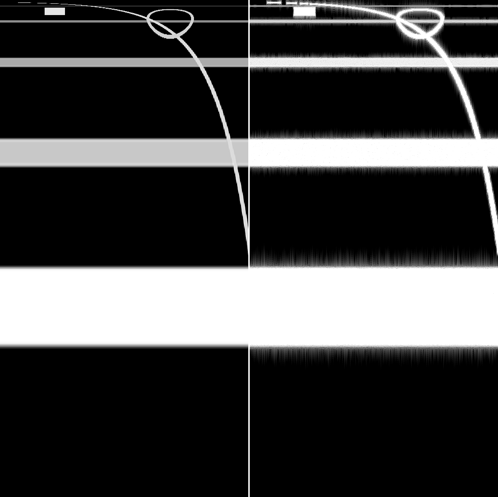

# img2spec

把一张图片变成一段 `.wav`，让这段音频的**短时傅里叶变换（STFT）幅度谱看起来就是这张图**。

图片的列 → 时间，图片的行 → 频率，图片的亮度 → 响度。

```bash
python img2spec.py logo.png logo.wav
```

---

## 先说要清楚的一件事：这不是可逆变换

STFT 的结果是**复数**，而图片只提供了**幅度**，相位完全未知。相位携带的信息量超过一半，所以「生成一个频谱恰好等于这张图的音频」在数学上**不可能精确成立**。

这是一个**相位重建**问题，本项目用 **Griffin-Lim 迭代**求解。你能得到的是：

- ✅ 图片的结构能清楚听出来——横条是持续音，斜线是滑音，竖条纹是打击/噪声，文字轮廓会变成有节奏的质感
- ⚠️ 音色带有 Griffin-Lim 特有的「相位感 / 金属感」，不是真实录音的质感
- ❌ 不可能是逐位精确的反变换，也不该拿它做数据隐藏

想要更干净的音质，唯一的路是把 Griffin-Lim 换成神经声码器（HiFi-GAN 之类），代价是要装 PyTorch 和下载预训练权重。当前实现是纯 `numpy + scipy`，秒级出结果、可复现（`--seed` 固定）。

---

## 安装（conda）

```bash
conda env create -f environment.yml
conda activate spectimg
```

也可以用路径前缀的方式建在项目目录内：

```bash
conda create -p ./.conda -c conda-forge python=3.13 numpy scipy pillow pip
conda run -p ./.conda python -m pip install soundfile
```

依赖说明：

| 包 | 是否必需 | 用途 |
|---|---|---|
| `numpy` | 必需 | 全部数值运算 |
| `scipy` | 必需 | FFT（比 `numpy.fft` 快）。缺失时会自动回退到 `numpy.fft` |
| `pillow` | 必需 | 读图与缩放 |
| `soundfile` | 可选 | 输出 24/32-bit 与 float WAV。**缺失时自动回退到标准库 `wave`**，此时只支持 16-bit（而 16-bit 正好是默认值） |

也就是说，最小可用依赖其实只有 `numpy + scipy + pillow`。

---

## 快速开始

```bash
# 生成一张合成测试图（横条=持续音、斜线=滑音、方块/圆环=节奏）
python tools/make_pattern.py demo/pattern.png

# 基本用法：一列像素 = 一个 STFT 帧
python img2spec.py demo/pattern.png demo/pattern.wav

# 压成固定 6 秒
python img2spec.py demo/pattern.png demo/pattern.wav --duration 6

# 最有用的一步：把重建出来的频谱和原图并排存成 PNG 用眼睛对比
python img2spec.py demo/pattern.png demo/pattern.wav --verify demo/compare.png
```

`demo/pattern.png` 用默认参数跑出来的实测结果：

```
image 512x320 -> 512 frames x 1025 bins, hop 512, 11.96s @ 22050 Hz
wrote demo/pattern.wav: 11.96s, peak 0.8913, rms -15.6 dBFS
verify: spectral convergence 0.4304 (lower is better),
        dB correlation 0.9838 (higher is better); inner 504 frames
```

`--verify` 生成的对比图左边是目标幅度谱、右边是生成音频的实际幅度谱，两者都在音频真正使用的线性频率网格上：



横条、扫频楔形、矩形块、圆环都对上了。横向的拖影是 Griffin-Lim 固有的时频不确定性，不是 bug。

---

## 参数：真正需要调的只有几个

### 音色

| 参数 | 默认 | 作用 |
|---|---|---|
| `--min-db` | `-80` | **主要的音色旋钮**。黑色像素对应的分贝值 |
| `--max-db` | `0` | 白色像素对应的分贝值 |
| `--no-zero-black` | 关 | 默认纯黑 = 完全静音；打开后纯黑 = 噪声地板 |
| `--gamma` | `1.0` | 亮度预矫正，>1 压暗暗部，<1 提亮 |
| `--channel` | `luma` | 用哪个通道：`luma` / `mean` / `r` / `g` / `b` |
| `--no-invert-y` | 关 | 默认图片顶部 = 高频，打开则相反 |

`--min-db` 调大到 `-40` 左右，只有最亮的结构会发声，结果干净很多；调到 `-100` 则所有暗部细节都变成声音，也更噪。

### 频率轴

| 参数 | 默认 | 作用 |
|---|---|---|
| `--freq-scale` | `log` | `linear` / `log` / `mel` |
| `--fmin` | `32` | `log`/`mel` 的最低频率（Hz）；`linear` 下忽略 |
| `--fmax` | Nyquist | 最高频率（Hz） |

**为什么默认是 `log`**：线性映射下，低频只占最底下几个像素，低音细节全丢，图上所有水平线都挤到高频区，听起来又薄又刺。对数映射下，4000 Hz 带宽的中间那一行是 400 Hz 而不是 2000 Hz——低八度终于拿到了它感知上应得的那部分图像行。想要 glitch / 纹理感的风格，`linear` 反而更好听。

### 时长与分辨率

| 参数 | 默认 | 作用 |
|---|---|---|
| `--sr` | `22050` | 采样率 |
| `--n-fft` | `2048` | FFT 长度，决定频率 bin 数 = `n_fft/2 + 1` |
| `--hop` | `512` | 帧间步长，越小越长越平滑 |
| `--frames` | 图片宽度 | 强制帧数 |
| `--duration` | 无 | 强制时长（秒），会覆盖 `--hop` |
| `--max-duration` | `60` | 超长自动截断，`0` 关闭 |

默认**一列像素 = 一个 STFT 帧**。`--duration` 则反过来调整 `--hop` 把图压进指定时长。

如果 `--duration` 把 `--hop` 压得过小（重叠超过 16 倍），脚本会警告：那种情况下大量计算是冗余的，相位估计也用不上那么多信息。

### 重建

| 参数 | 默认 | 作用 |
|---|---|---|
| `--iterations` | `64` | Griffin-Lim 迭代次数，`0` = 纯随机相位（噪声音频，值得听一次做对比） |
| `--momentum` | `0.99` | Fast Griffin-Lim 动量 |
| `--seed` | `0` | 初始相位随机种子，固定后可复现 |

**迭代次数不是越多越好。** 实测：

| iterations | 0 | 1 | 4 | 16 | 64 | 256 | 1024 |
|---|---|---|---|---|---|---|---|
| spectral convergence | 0.656 | 0.516 | 0.454 | 0.408 | 0.408 | 0.388 | 0.404 |

16–64 次就到平台期了，再加基本是浪费算力。平台值不为零是本质的：手画的频谱（比如一个干净的矩形）根本不在 STFT 算子的值域里，任何相位都做不到。

### 输出

| 参数 | 默认 | 作用 |
|---|---|---|
| `--normalize` | `peak` | `peak` / `rms` / `none` |
| `--target-db` | `-1` | 归一化目标电平 |
| `--bits` | `16` | `16` / `24` / `32` / `float`（后三者需要 `soundfile`） |
| `--verify PNG` | 无 | 输出频谱对比图并打印指标 |
| `--quiet` | 关 | 静默进度输出 |

---

## 它到底怎么工作

```
图片
 ├─ 通道提取（默认 luma: 0.299R+0.587G+0.114B），带 alpha 时先合成到黑底
 ├─ 垂直翻转（图片第 0 行在顶部 = 高频，而数组第 0 行要给最低频）
 ├─ 缩放到 (n_bins, n_frames) = (1025, 帧数)，BICUBIC
 ├─ 亮度 → 分贝 → 线性幅度        ← 见下方「坑 1」
 ├─ 频率轴重映射（log/mel 网格 → 音频的线性 bin）  ← 见下方「坑 2」
 └─ 目标幅度谱 M
        ↓
    Griffin-Lim（带 Fast GL 动量）
      ① y = ISTFT(M · e^{jφ})，φ 初始为随机相位
      ② φ̂ = ∠STFT(y)
      ③ φ ← φ̂ + momentum·(φ̂ − φ)
      ④ 重复，最后用 φ̂ 重新合成一次
        ↓
    峰值归一化 → 写 WAV
        ↓
    --verify：重新分析生成的音频，和 M 并排存 PNG + 打印指标
```

### 坑 1：亮度不能直接当幅度

把像素值 0–255 线性映射成幅度，听感会接近白噪声而且严重削波。正确做法是走**分贝**：像素 0 → `--min-db`，像素 255 → `--max-db`，中间在 dB 域线性插值，再取 `10^(dB/20)`。

### 坑 2：ISTFT 的逐样本归一化会在两端炸掉

这是实现里最隐蔽的一个坑，值得记下来。重叠相加合成时按每个样本的窗和归一化看起来最严谨——内部区域能精确到机器精度。但信号最前和最后 `n_fft` 个样本的窗和趋近于零，除以它会把随机相位合成分量**放大五个数量级**：

- 症状：生成音频 peak 出现在第 4 个采样点，而占绝大部分的主体被归一化压到 −89 dBFS（峰均比 49 dB）
- 更坏的是，`--verify` 的 dB 相关系数此时还是 **0.98**——因为两侧都被 −100 dB 的地板拄住了，指标在测「大家一起静音」，是个假阳性
- 修法：改成用**稳态窗和的标量**归一化。代价是首尾各有 `n_fft` 个样本的自然淡入淡出（真实的 STFT 前端本来就这样），换来的是内部依旧精确、两端不再爆

修完：rms 从 −49.9 → −14.3 dBFS，峰均比 49 dB → 13.1 dB。测试里 `istft(..., normalize="exact")` 保留了这个精确模式，用来断言内部往返误差 < 1e-10。

### 坑 3：别按图片宽高比推帧数

早期版本让 `n_frames = 宽/高 × n_bins`，于是 512×320 的图被放大成 1640 帧，`--duration 6` 把 hop 压到 79（26 倍重叠）。这既慢又毫无意义：频谱图的坐标轴是**赫兹和秒**，它的宽高比不携带任何信息。改成一列像素 = 一帧后，同样任务从 11.9 秒降到 1.7 秒。

---

## 测试

```bash
python -m unittest discover -s tests -v     # 38 个测试
python -m pytest tests -q                   # 或者用 pytest
```

测试图是**在测试里程序化生成的**，不是提交的 fixture——这样测试断言的是变换的性质，而不是某张碰巧提交过的图。覆盖：

- 通道提取、alpha 合成、频率轴（linear/log/mel）、行重映射、外插钳位
- 图片 → 幅度谱的极性（顶部=高频）、全黑=静音、全白=满幅、渐变单调
- STFT/ISTFT 内部往返误差 < 1e-10、标量归一化在两端不产生瞬态
- Griffin-Lim 收敛性（合法目标 vs 不可能目标）、种子可复现、静音输入不产生 NaN
- 归一化与 WAV 写出（削波而非回绕）、非法位深
- 时长/帧数规划与 `--max-duration` 截断
- CLI 端到端、纯黑图、1×1 图、非 2 的幂 `--n-fft`、图片不存在

---

## 局限

- **相位重建有上限**：高频区天然更差（重叠帧更少），要突破只能换神经声码器
- **时长由图片宽度驱动**：1024 px 宽的图在 `sr=22050 / hop=512` 下约 23.8 秒。用 `--duration` 或 `--max-duration` 约束
- **8-bit 处理**：图片会被 `convert("RGB")`，16-bit PNG 会降到 8-bit
- **sRGB 未线性化**：像素值直接映射到 dB，没有做 gamma 解码，`--gamma` 是手动补偿
- **"频谱"的歧义**：这里实现的是 STFT 幅度谱（有时间轴）。如果你要的是单帧 FFT 频谱，那是完全不同的另一件事

---

## 文件

| 路径 | 说明 |
|---|---|
| `img2spec.py` | 主脚本，全部逻辑 |
| `environment.yml` | conda 环境定义 |
| `tests/test_img2spec.py` | 38 个单元测试 |
| `tools/make_pattern.py` | 生成合成演示图 |
